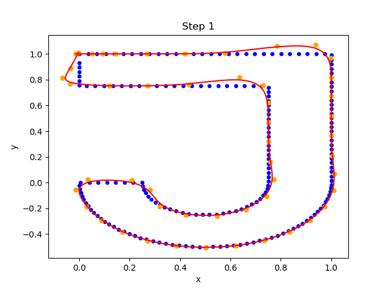

# B-Splines

The goal of this work is to analyze the Progressive and Iterative Approximation for Least Square fitting algorithm (LSPIA, [C. Deng, H. Lin (2013) CAD](https://doi.org/10.1016/j.cad.2013.08.012)), which computes an iterative approximation for least squares B-spline curves.

For details, check out the [report](report.pdf).

## Results visualization

    
       
    Figure 1 : Evolution of the fitting curve

    
       
    Figure 2 : Approximation curve after 49 iterations

    
       
    Figure 3 : LSPIA converges towards the least squares solution

