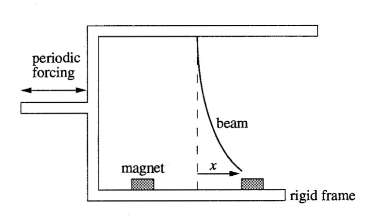
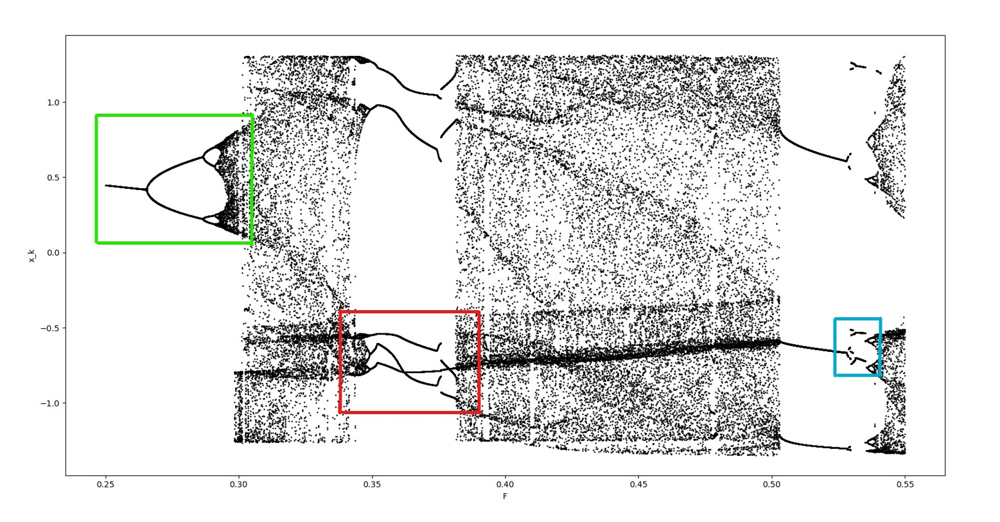
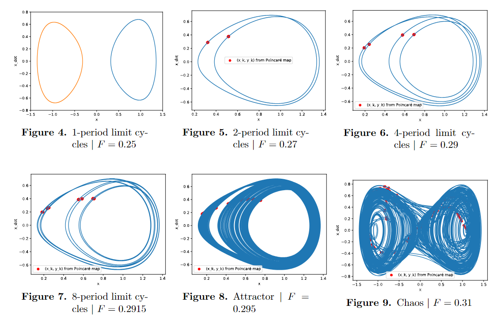

# Duffing Equation

The goal of this project is to analyze the Duffing equation with a sinusoidal excitation : 

$$\ddot{x} + \delta \dot{x} - x + x^3 = F \cos (\omega t)$$

with

- $x$ : displacement from equilibrium position;
- $t$ : time;
- $\delta$ : damping effects;
- $F$ : amplitude of the excitation;
- $\omega$ : angular frequency of the excitation.

    
       
    Figure 1 : Physical system (from [1])

For details, check out the [report](report.pdf).

## Results visualization

    
       
    Figure 2 : Strange attractor

    
       
    Figure 3 : Bifurcation diagram when varying F, all other parameters are fixed.    
    We observe period-doubling, reverse period-doubling, but also chaos and interruptions in period-doubling...

    
       
    Figure 4 : Trajectories for different F values, from period-doubling towards chaos

[1] [S. Strogatz, Nonlinear Dynamics and Chaos, 2018](https://www.google.com/url?sa=t&rct=j&q=&esrc=s&source=web&cd=&cad=rja&uact=8&ved=2ahUKEwimx_7Qir-EAxVTxQIHHRHvDJQQFnoECDMQAQ&url=https%3A%2F%2Fwww.biodyn.ro%2Fcourse%2Fliteratura%2FNonlinear_Dynamics_and_Chaos_2018_Steven_H._Strogatz.pdf&usg=AOvVaw1NK_W_v__SrazRcFXjeLG2&opi=89978449)