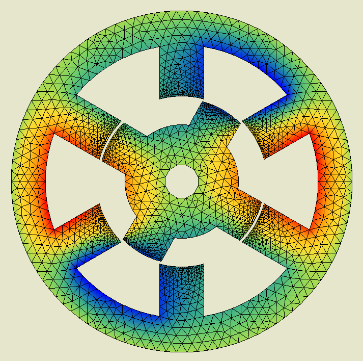

# Simulation of a Switched Reluctance Motor with Finite Element Method

The goal of this work is to simulate a 2D switched reluctance motor by solving the steady-state Maxwell-Ampère equation with the finite element method and the conjugate gradients algorithm (with preconditioning) : 

$$\frac{\partial}{\partial x} \left ( \frac{1}{\mu}\frac{\partial a}{\partial x} \right ) + \frac{\partial}{\partial u} \left ( \frac{1}{\mu}\frac{\partial a}{\partial y} \right ) + j_s = 0  $$

where we have

- $a$ : magnetic potential;
- $\mu$ : magnetic permeability;
- $j_s$ : source current.

For details, check out the [report](report.pdf). Unfortunately, the code is not publicly available.

## Results visualization

    
       
    Figure 1 : Snapshot of the magnetic potential in the rotor and the stator at a given timestep

    
       
    Figure 2 : Remeshing of the air gap (green) between the rotor and the stator (both red)

    
       
    Figure 3 : Torque induced for each configuration of activated current coils,    in function of the rotor angular position.    It shows which coil to activate to obtain a maximal torque.

    
       
    Figure 4 : Torque induced for each configuration of activated current coils,    in function of the rotor angular position.    It shows which coil to activate to obtain a nul torque.

    
       
    Figure 5 : Convergence rate of conjugate gradients method for different mesh sizes and matrix preconditioning

