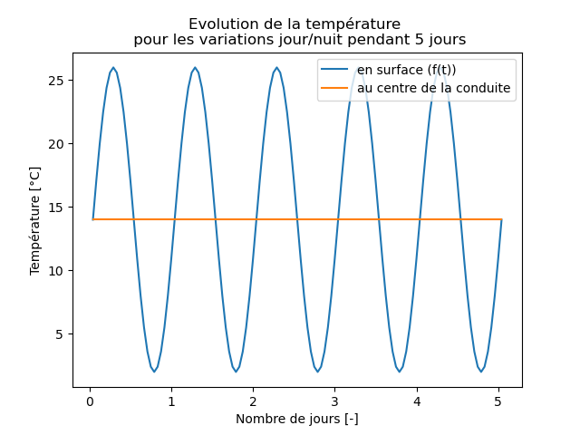
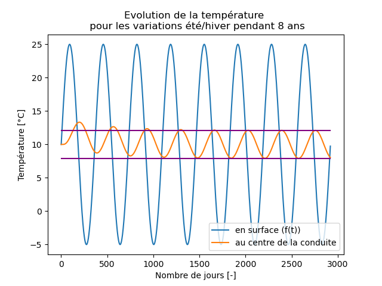
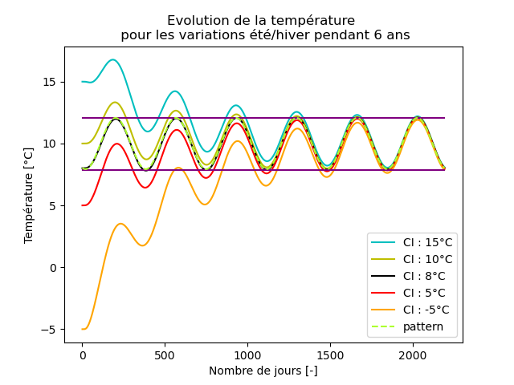
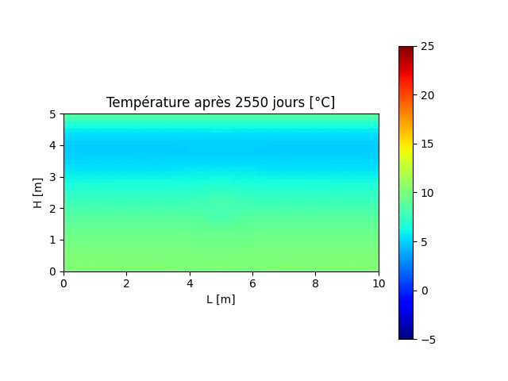
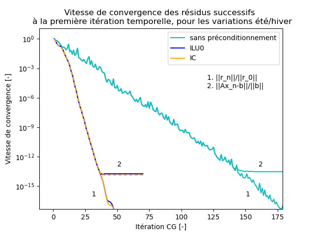

# Heat exchanger

The goal of this project is to analyze the temperature evolution in a pipe filled with air and situated under the ground.

## Setup

The study domain is a vertical cross-section through the subsurface. A small square in the middle of the section represents the pipe.

We study the influence of temporal surface temperature variations by imposing a boundary condition at the upper surface which varies sinusoidally in time. We analyze two different cases for this surface temperature : 
- day/night variations;
- summer/winter variations.

All three other boundaries are no-flux boundaries.

## Equation

We need to solve the 2D heat diffusion equation :

$$\frac{\partial T}{\partial t} = \frac{\lambda}{\rho c_p} \nabla^2 T $$

with

- $T(x,y,t)$ : temperature;
- $\lambda$ : heat conductivity;
- $\rho c_p$ : volumic heat capacity.

Finite differences are used to discretize the equation. The conjugate gradients method (with and without preconditioning) is used to solve the system.

## Run

Before compiling, make sure that you installed BLAS library.

To compile the code, just execute the command: \
```gcc heat_exchanger.c -o exec -lm -lblas -O3```

To run it, launch the executable with the parameters explained later, for example: \
```./exec 0 5 20 365 1 "output.txt"```

## Parameters

Parameters when we run ```./exec case nb M N param fichier.out``` :
   
- case : 1 to take the day/night alternation, 0 for the summer/winter alternation;
- nb : number of periods to take (i.e. number of days if case=1, number of years otherwise);
- M : spatial discretization (number of steps in the vertical direction);
- N : time discretization (number of timesteps during one year);
- param : 0 to use conjugate gradients method without preconditioning, 1 with ILU0 preconditioning, and 2 with IC preconditioning;
- fichier.out : output file that contains the temperature evolution at the center of the pipe.


## Results visualization


<p align="center">
    
    <br>  
    Figure 1 : Temperature evolution at the center of the pipe (orange) and at the surface (blue), for day/night variations.  
    <br>  
    The surface temperature does not influence the air temperature in the pipe.
</p>


<p align="center">
    
    <br>  
    Figure 2 : Temperature evolution at the center of the pipe (orange) and at the surface (blue), for summer/winter variations.
    <br>  
    Here, the surface temperature does influence the air temperature in the pipe.
</p>

<p align="center">
    
    <br>  
    Figure 3 : Temperature evolution at the center of the pipe, for summer/winter variations,  <br>  for different initial pipe temperatures
</p>


<p align="center">
    
    <br>  
    Figure 4 : Evolution of the temperature field in the cross-section between year 7 and 8, <br> for summer/winter variations
</p>

<p align="center">
    
    <br>  
    Figure 5 : Temperature field after 7 years, for summer/winter variations (with a more adapated color scale to see the pipe)
</p>

<p align="center">
    
    <br>  
    Figure 6 : Convergence rates of the conjugate gradients algorithm with (dark blue and orange) and without (light blue) preconditioning for summer/winter variations
</p>


For details, check out the [report](report.pdf).