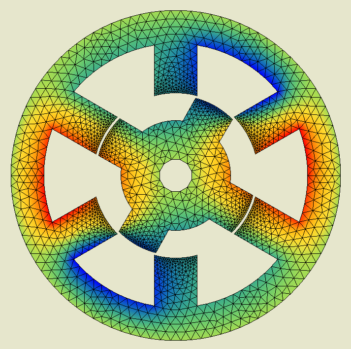
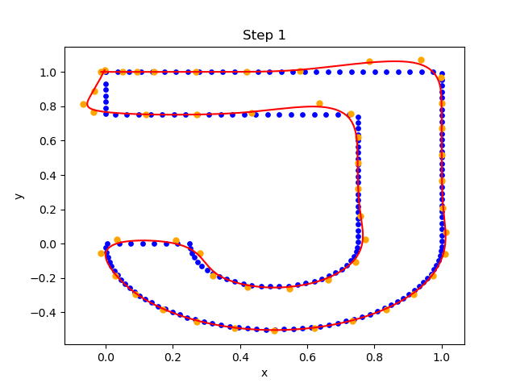
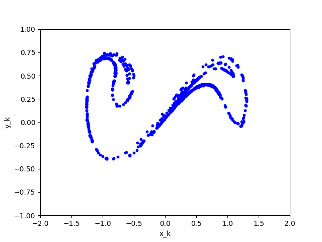

# Projects

This repository contains various projects realized during my studies in Applied Mathematics, at UCLouvain in Belgium (2018-2023).

 <table style="width:90%;" bgcolor="white" border="0">
        <tr>
            <td align="center"></td>
            <td align="center"></td>
        </tr>
        <tr>
            <td align="center"></td>
            <td align="center"></td>
        </tr>
</table>

