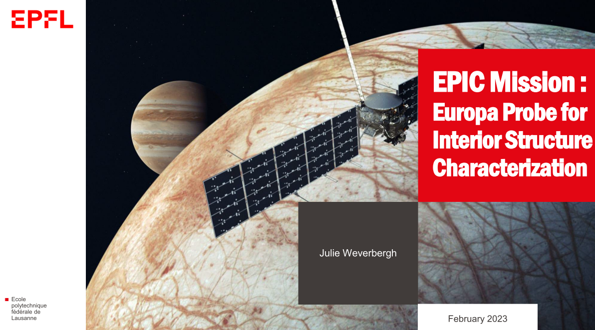

# Satellite Design: Mission Concept

The goal of this project is to design a mission to send a probe in orbit around Europa (Jupiter's moon).

    
      
    For details, check out the <a href="./Presentation.pdf">Presentation</a>

